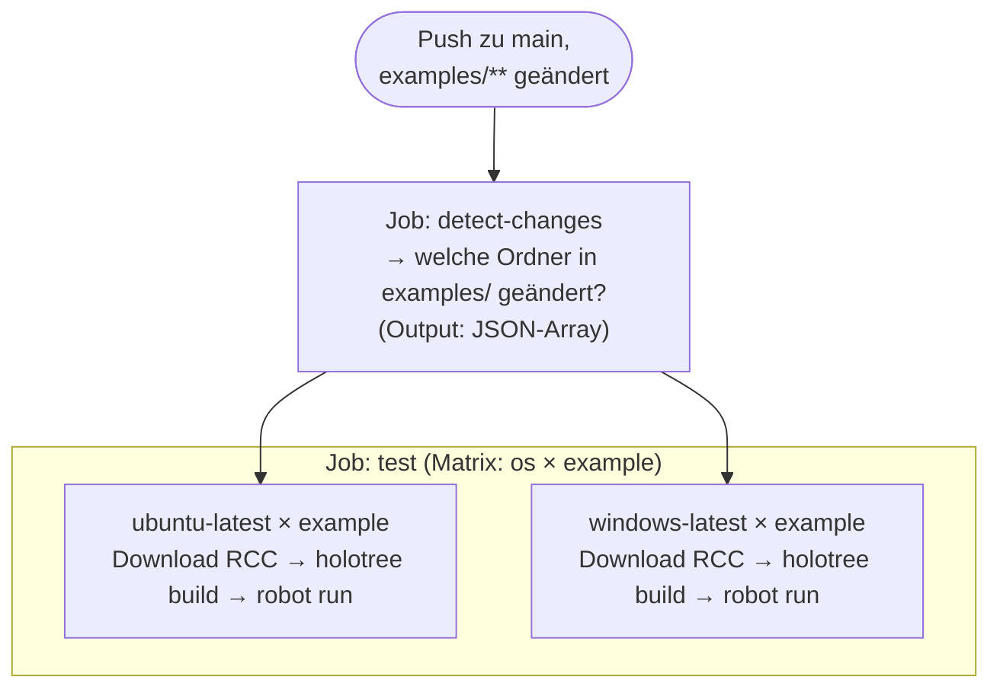

# _dev — Maintainer Tooling

> **Dieses Verzeichnis ist für Maintainer des Repos gedacht, nicht für Nutzer.**  
> Nutzer arbeiten ausschließlich mit dem `examples/`-Ordner.

---

## Überblick

```
_dev/
├── _devcontainers/      ← Zentralisierte Devcontainer-Templates
│   ├── headless/        ← Für Beispiele mit RMKS_DEVCONTAINER=headless
│   │   ├── copier.yml
│   │   └── template/
│   │       └── .devcontainer/
│   │           ├── devcontainer.json.jinja
│   │           └── setup.sh
│   └── desktop/         ← Für Beispiele mit RMKS_DEVCONTAINER=desktop
│       ├── copier.yml
│       └── template/
│           └── .devcontainer/
│               ├── devcontainer.json.jinja
│               └── setup.sh
├── _environments/       ← Gemeinsame RCC-Environments (conda.yaml-Quellen)
│   ├── rf/
│   ├── rf-libbrowser/
│   ├── rf-libbrowser-libcrypto/
│   └── rf-libcrypto/
│       ├── copier.yml
│       └── template/
│           ├── conda.yaml.jinja
│           └── versions.partial.md.jinja   ← Versions-Tabelle für README
├── _examples/           ← Copier-Quellen für examples/ (vollständige Beispiele)
│   ├── cryptolibrary-simple/
│   │   ├── copier.yml
│   │   ├── README.partial.md    ← Beispiel-spezifischer README-Teil
│   │   └── template/
│   │       └── .env             ← RMKS_ENVIRONMENT, RMKS_DEVCONTAINER, VNC_RESOLUTION optional
│   ├── web-cryptolibrary/
│   │   ├── copier.yml
│   │   ├── README.partial.md
│   │   └── template/
│   │       └── .env             ← RMKS_ENVIRONMENT, RMKS_DEVCONTAINER, VNC_RESOLUTION optional
│   └── web-webshop/
│       └── …
├── _shared/
│   └── README.md.jinja          ← Gemeinsame README-Sektionen
├── _templates/          ← Copier-Quellen für templates/ (minimale Skeletons)
├── _labs/               ← Copier-Quellen für labs/ (Checkmk-Praxislabs für Studenten)
│   └── robotmk-lab-slac26/
│       ├── copier.yml
│       ├── README.partial.md    ← Lab-spezifischer README-Teil
│       └── template/
│           └── .env             ← RMKS_ENVIRONMENT, RMKS_DEVCONTAINER, VNC_RESOLUTION optional
├── config/
│   └── versions.env     ← Versionspins (einzige Pflegestelle!)
├── .rcc/                ← Nur RCC-Binaries (NICHT für Konfiguration, NICHT committed)
└── scripts/
    ├── generate-all.sh   ← Alle examples/ und templates/ generieren (Linux/macOS)
    └── generate-all.ps1  ← Alle examples/ und templates/ generieren (Windows)
```

---

## 1. Erster Setup nach dem Klonen

Alle wiederkehrenden Aufgaben sind als [Taskfile](https://taskfile.dev)-Tasks definiert.
Installation (einmalig, falls noch nicht vorhanden):

```bash
brew install go-task   # macOS
# oder: https://taskfile.dev/installation/
```

Danach genügt ein einziger Befehl für den vollständigen Setup:

```bash
task setup   # installiert copier + lädt RCC-Binary herunter
```

Oder manuell:

```bash
task install-copier   # Copier ins .venv installieren
task download-rcc     # RCC-Binary nach _dev/.rcc/ laden (Linux/macOS, nur Binary, keine .rcc-Konfig mehr)
task download-rcc-windows  # RCC-Binary laden (Windows)
```

### Verfügbare Tasks

```
task setup                          # Einmaliger Setup (copier + RCC + git hooks)
task install-copier                 # Nur copier installieren
task download-rcc                   # Nur RCC laden (Linux/macOS)
task install-hooks                  # Git hooks registrieren (.githooks/)
task generate                       # Alle examples/ aus Templates generieren
task generate EXAMPLE=cryptolibrary # Einzelnes Beispiel generieren
task test EXAMPLE=cryptolibrary     # Beispiel lokal testen
task shell EXAMPLE=cryptolibrary    # Interaktive Shell im RCC-Environment
```

---

## 2. Wie Copier hier eingesetzt wird (Modell 2 — intern)

Copier wird **ausschließlich vom Maintainer** genutzt. Nutzer sehen Copier nie.

### Warum Copier?

Die Beispiele in `examples/` sind keine handgeschriebenen Einzeldateien — sie werden
aus Templates in `_dev/_templates/` **generiert**. Das ermöglicht:

- **Konsistenz**: `conda.yaml`, `robot.yaml` und Boilerplate sind in allen Beispielen identisch
- **Versionspflege**: Eine Stelle (`generate-all.sh`) steuert alle Versionen
- **Reproducibility**: `.copier-answers.yml` in jedem generierten Ordner hält fest, mit
  welchen Versionen das Beispiel zuletzt generiert wurde

### Template-Struktur

Jeder Beispieltyp hat ein eigenes Template (kein Mono-Template mit ``-Chains):

```
_dev/_examples/cryptolibrary/
├── copier.yml           ← Variablen-Definitionen (werden von versions.env befüllt)
└── template/            ← Inhalt, der nach examples/cryptolibrary/ kopiert wird
    ├── .env             ← RMKS_ENVIRONMENT + RMKS_DEVCONTAINER + projekt-spezifische Vars
    ├── robot.yaml       ← Statische Datei (wird unverändert kopiert)
    ├── suite.robot      ← Statische Datei
    ├── robot.toml       ← Statische Datei
    ├── keys/            ← Statische Dateien (CryptoLibrary-Schlüssel)
    └── .copier-answers.yml.jinja  ← Tracking-Datei (wird generiert)
    # conda.yaml fehlt hier absichtlich — wird vom Environment injiziert (s. u.)
```

> **`_subdirectory: template`** in `copier.yml` ist entscheidend: Copier kopiert nur den
> Inhalt von `template/`, nicht `copier.yml` selbst.

### Shared Environments — `_environments/` und `RMKS_ENVIRONMENT`

Mehrere Beispiele teilen sich oft dieselbe `conda.yaml` (z. B. alle, die Browser + Crypto
benötigen). Statt die `conda.yaml.jinja` in jedes Template zu duplizieren, gibt es eine
zentrale Quelle in `_environments/`.

**Ablauf beim Generieren:**

1. `generate-all.sh` liest `RMKS_ENVIRONMENT` aus `template/.env`:
   ```ini
   RMKS_ENVIRONMENT=rf-libbrowser-libcrypto
   ```
2. Es ruft Copier für `_environments/rf-libbrowser-libcrypto/` auf und **injiziert**
   `conda.yaml` in `_dev/_examples/<name>/template/` (temporär, für den nächsten Schritt).
3. Danach folgt die eigentliche Generierung: Copier kopiert alles aus `template/` —
   inklusive der frisch injizierten `conda.yaml` — nach `examples/<name>/`.

**Environment-Struktur:**

```
_dev/_environments/rf-libbrowser-libcrypto/
├── copier.yml           ← Variablen (rf_version, rf_lib_browser_version, …)
└── template/
    └── conda.yaml.jinja ← Eine conda.yaml für alle Beispiele mit diesem Environment
```

Der **Space-Name** (`rf-libbrowser-libcrypto`) hat zwei Bedeutungen:
- Verzeichnisname in `_environments/` → Copier findet das richtige Template
- RCC Holotree Space-Name → Beispiele mit demselben Space teilen sich den Environment-Cache

`RMKS_ENVIRONMENT` in `template/.env` wird von `generate-all.sh` gelesen, um den richtigen
Space zu injizieren, und von `task test` / `task shell`, um den richtigen Space an RCC zu
übergeben.

### `.copier-answers.yml` — Tracking-Datei

Jedes generierte Beispiel enthält eine `.copier-answers.yml`. Diese Datei wird **committed**
und dient als "Stempel": welche Template-Version und welche Paketversionen wurden zuletzt
verwendet.

```yaml
# .copier-answers.yml (Beispiel)
_src_path: /Users/simon/…/_dev/_templates/cryptolibrary
rf_version: 7.1.1
browser_version: 19.12.5
```

### Shared README — `_shared/` und Partials

Jedes generierte Beispiel erhält ein einheitlich aufgebautes `README.md`. Die Struktur ist
aufgeteilt in einen **gemeinsamen** und einen **beispiel-spezifischen** Teil:

```
_dev/
├── _shared/
│   └── README.md.jinja          ← Gemeinsame Sektionen (Prerequisites, Libraries & Versions,
│                                   How to Run); enthält 
└── _examples/
    └── <name>/
        ├── README.partial.md    ← Beispiel-spezifisch: Titel, Beschreibung, What This
        │                           Demonstrates, Test Cases, Key Files, Links
        └── template/            ← README.partial.md liegt bewusst NICHT hier
            └── README.md.jinja  ← wird vom Skript temporär hierhin kopiert (s. u.)
```

**Ablauf beim Generieren:**

1. `generate-all.sh` prüft, ob `_dev/_shared/README.md.jinja` und
   `_dev/_examples/<name>/README.partial.md` beide existieren.
2. Falls ja: `README.md.jinja` wird temporär nach `_dev/_examples/<name>/template/` kopiert
   (damit Copier es als Output-Datei `README.md` rendert).
3. Copier rendert `README.md.jinja` — dabei löst `` die
   Partial-Datei auf. Copier's Jinja-Loader sucht Includes im **Root** des Quell-Verzeichnisses
   (neben `copier.yml`), deshalb liegt `README.partial.md` dort und nicht in `template/`.
4. Das temporäre `README.md.jinja` wird nach dem Copier-Lauf wieder entfernt.

**Versions-Tabelle im README:**

Jedes Environment legt in `template/versions.partial.md.jinja` fest, welche Pakete es
mitbringt. `generate-all.sh` injiziert diese Datei zusammen mit `conda.yaml` ins Beispiel.
Das Shared-README inkludiert sie mit ``.

```
_dev/_environments/rf-libbrowser-libcrypto/template/versions.partial.md.jinja:

| Library | Version |
|---|---|
| Python | `{{ python_version }}` |
| Node.js | `{{ nodejs_version }}` |
| Robot Framework | `{{ rf_version }}` |
| robotframework-browser | `{{ rf_lib_browser_version }}` |
| robotframework-crypto | `{{ rf_lib_crypto_version }}` |
```

**Neues Beispiel mit README:**

1. `_dev/_examples/<name>/README.partial.md` anlegen (Inhalt s. bestehende Partials als
   Vorlage). Die Partial-Datei darf selbst Jinja-Variablen (`{{ rf_version }}` etc.) nutzen.
2. `task generate EXAMPLE=<name>` — der Rest passiert automatisch.

**`_dev/_templates/` (Skeletons)** erhalten kein README — dort existiert kein
`README.partial.md`, und `generate-all.sh` überspringt die README-Injektion in diesem Fall
stillschweigend.

---

## 3. Versionen pflegen

**Einzige Pflegestelle**: [`_dev/config/versions.env`](config/versions.env)

```ini
RF_VERSION=7.1.1
RF_LIB_BROWSER_VERSION=19.12.5
RF_LIB_CRYPTO_VERSION=0.3.0
PYTHON_VERSION=3.12
PIP_VERSION=23.2.1
NODEJS_VERSION=22.11.0
```

Beide Skripte (`generate-all.sh` und `generate-all.ps1`) lesen diese Datei automatisch —
keine Anpassung in den Skripten selbst nötig.

Nach einer Anpassung:

```bash
task generate
git add examples/
git commit -m "chore: bump RF to 7.2.0"
```

Für ein einzelnes Beispiel:

```bash
task generate EXAMPLE=cryptolibrary
```

---

## 4. Neues Beispiel hinzufügen

### Bestehendes Environment verwenden

Falls das neue Beispiel Browser + Crypto benötigt (wie alle bisherigen):

1. **Quellen anlegen**:
   - `_dev/_examples/<name>/copier.yml` (minimalst: nur `_subdirectory: template`)
   - `_dev/_examples/<name>/template/.env` mit `RMKS_ENVIRONMENT=rf-libbrowser-libcrypto`
     und `RMKS_DEVCONTAINER=desktop` (oder `headless`)
   - `_dev/_examples/<name>/template/` mit `robot.yaml`, `suite.robot`, `robot.toml`, ...
   - Analog für `_dev/_templates/<name>/` (Skeleton-Variante)
2. **Generieren**: `task generate EXAMPLE=<name>`
3. **Commit**: `examples/<name>/` und `templates/<name>/` committen (inkl. `.copier-answers.yml`)
4. **CI**: Der `detect-changes`-Job erkennt das neue Verzeichnis automatisch.

### Neues Environment anlegen

Falls das neue Beispiel andere Dependencies braucht (z. B. nur SeleniumLibrary):

1. **Environment-Verzeichnis anlegen**:
   ```
   _dev/_environments/<space-name>/
   ├── copier.yml           ← mindestens: _subdirectory: template
   └── template/
       └── conda.yaml.jinja ← conda-Abhängigkeiten mit Jinja2-Variablen
   ```
2. **`RMKS_ENVIRONMENT`** in `template/.env` auf den neuen Space-Namen setzen:
   ```ini
   RMKS_ENVIRONMENT=<space-name>
   ```
3. Falls neue Versionen nötig: in `versions.env` ergänzen und in `generate-all.sh/ps1` als
   `--data`-Parameter aufnehmen.
4. Generieren und committen wie oben.

---

## 5. Labs hinzufügen

Labs sind Checkmk-basierte Praxisumgebungen für Studenten. Sie werden als eigenständige
GitHub-Repos veröffentlicht, die direkt als Codespace geöffnet werden können.

**Unterschiede zu `examples/` und `templates/`:**

| Aspekt | examples/ | templates/ | labs/ |
|---|---|---|---|
| Zweck | Vollständige Beispiele | Minimale Skeletons | Praxislabs (mehrere Suites) |
| Devcontainer | `desktop` oder `headless` | keiner | `cmk25` (Checkmk-Image) |
| Devcontainer-Steuerung | `RMKS_DEVCONTAINER` in `template/.env` | — | `RMKS_DEVCONTAINER` in `template/.env` |
| CI (GitHub Actions) | ✓ | — | — |
| Codespace-Zielrepo | `robotmk/example-<name>` | — | eigenes Repo (manuell pushen) |
| Suiten-Status | vollständig & lauffähig | Skeleton | können unvollständig sein |

### Neues Lab anlegen

1. **Quellen anlegen**:
   ```
   _dev/_labs/<name>/
   ├── copier.yml           ← minimal: nur _subdirectory: template
   ├── README.partial.md    ← Lab-spezifischer README-Teil (s. u.)
   └── template/
       ├── .env             ← RMKS_ENVIRONMENT=<env-name>, RMKS_DEVCONTAINER=cmk25
       ├── robot.yaml
       └── rf-suites/       ← oder beliebige Struktur
           ├── robot.toml
           └── suite.robot
   ```

2. **`README.partial.md` anlegen** — enthält ``
   statt `how-to-run.partial.md`. Als Vorlage kann `_dev/_labs/robotmk-lab-slac26/README.partial.md`
   dienen.

3. **Generieren**:
   ```bash
   task generate EXAMPLE=<name>
   ```
   Erzeugt `labs/<name>/` mit fertigem `.devcontainer/`.

4. **Veröffentlichen** (manuell):
   ```bash
   cd labs/<name>
   git init && git add . && git commit -m "initial"
   git remote add origin git@github.com:robotmk/<name>.git
   git push -u origin main
   ```

### `how-to-run-lab.partial.md`

Für Labs gibt es eine eigene shared-Partial in `_dev/_shared/how-to-run-lab.partial.md`
mit angepasstem Codespaces-Badge und labsspezifischem Text. Der README.partial.md eines
Labs inkludiert diese statt `how-to-run.partial.md`.

---

## 6. RCC — Robot Command Center


RCC ist das Umgebungs- und Task-Runner-Tool von Robocorp, das auch Robotmk intern nutzt.
Es baut isolierte Python-Environments aus `conda.yaml` und führt Robot Framework-Suites aus.

### Warum RCC statt `pip install`?

- RCC baut **reproduzierbare, isolierte Environments** (Holotree) — identisch lokal und in CI
- Nutzer brauchen **kein Python** installiert — nur RCC
- `rccPostInstall` in `conda.yaml` führt `rfbrowser init` nach dem Environment-Build aus

### RCC lokal verwenden

```bash
# Suite ausführen (baut Environment automatisch beim ersten Mal)
task test EXAMPLE=cryptolibrary

# Interaktive Shell im RCC-Environment (Debug, rfbrowser init prüfen, …)
task shell EXAMPLE=cryptolibrary
```

### RCC Binary herunterladen

Binaries werden **nicht committed** (`.gitignore`-Eintrag: `_dev/.rcc/rcc*`).
Hinweis: Die `.rcc`-Verzeichnisse enthalten nur noch die RCC-Binaries, nicht mehr die Konfigurationsdateien. Die Auswahl der Umgebung erfolgt jetzt ausschließlich über `.env` mit `RMKS_ENVIRONMENT` und `RMKS_DEVCONTAINER`.

```bash
task download-rcc          # Linux/macOS
task download-rcc-windows  # Windows
```


Das Skript lädt RCC v4.0.0 aus dem Robotmk-Release herunter:
`https://github.com/elabit/robotmk/releases/download/v4.0.0/rcc_linux64`  
Für eine andere Version: URL und Tag in `download-rcc.sh` / `download-rcc.ps1` anpassen.

---

## 7. GitHub Actions CI

### Workflow: `test-examples.yml`

2-stufiges Design:



- **`fail-fast: false`**: Ein fehlgeschlagenes Beispiel bricht nicht den Rest ab
- **`workflow_dispatch`**: Manueller Trigger; `example`-Input für gezielten Test eines Beispiels
- **RCC in CI**: Wird per `curl` von GitHub Releases heruntergeladen — kein committed Binary nötig

### Lokale CI-Tests mit `act`

[`act`](https://github.com/nektos/act) simuliert GitHub Actions lokal in Docker.

```bash
# Installation (macOS)
brew install act
```

Eine `.actrc` im Repo-Root setzt das Docker-Image vor — kein manuelles Flag nötig:

```
-P ubuntu-latest=catthehacker/ubuntu:act-22.04
```

Danach:

```bash
# Alle geänderten Suites testen (simuliert push)
act push -j test

# Nur eine Suite (workflow_dispatch)
act workflow_dispatch -j test --input suite=examples/cryptolibrary
act workflow_dispatch -j test --input suite=templates/cryptolibrary

# Nur den detect-changes Job
act push -j detect-changes
```

### Workflow: `release-please.yml`

Auf jedem Merge in `main` prüft Release Please, ob Conventional-Commit-Messages
einen Release rechtfertigen (`feat:`, `fix:`, etc.). Falls ja, öffnet es automatisch
einen Release-PR mit Changelog. Nach dem Merge wird ein GitHub Release erzeugt.

Basic:

- `build` Commits that affect build-related components such as build tools, dependencies, project version, ...
- `chore` Commits that represent tasks like initial commit, modifying `.gitignore`, ...
- `docs` Commits that exclusively affect documentation
- `feat` Commits that add, adjust or remove a feature to/of/from the API or UI
- `fix` Commits that fix an API or UI bug of a preceded `feat` commit
- `test` Commits that add missing tests or correct existing ones
- `ops` Commits that affect operational aspects like infrastructure (IaC), deployment scripts, CI/CD pipelines, backups, monitoring, or recovery procedures, ...

Advanced: 

- `refactor` Commits that rewrite or restructure code without altering API or UI behavior
- `perf` Commits are special type of `refactor` commits that specifically improve performance
- `style` Commits that address code style (e.g., white-space, formatting, missing semi-colons) and do not affect application behavior

---

## 8. Branch-Strategie für ältere Versionen

`main` enthält immer die **aktuellste** Dependency-Kombination.

Für ältere Kombinationen (z. B. RF 6 + Browser 19.1) gibt es `compat/**`-Branches:

```bash
git checkout -b compat/rf6-browser191
# Versionen in generate-all.sh anpassen → RF_VERSION="6.1.1", BROWSER_VERSION="19.1.x"
task generate
git commit -m "chore: set versions for RF6/Browser191 compat branch"
git push origin compat/rf6-browser191
```

Der CI-Workflow läuft automatisch auch auf `compat/**`-Branches (`branches: ["main", "compat/**"]`).

---

## 9. Codespaces / Devcontainer

Für Workshops und schnellen Einstieg ohne lokale Installation.

### Zentralisierte Devcontainer-Templates (`_devcontainers/`)

Devcontainer-Konfigurationen werden **nicht** direkt in den Beispiel-Templates gepflegt,
sondern zentral in `_dev/_devcontainers/` und beim Generieren injiziert.

```
_dev/_devcontainers/
├── headless/           ← Reines Python-Image, kein VNC
│   ├── copier.yml
│   └── template/.devcontainer/
│       ├── devcontainer.json.jinja
│       └── setup.sh
├── desktop/            ← Python-Image + desktop-lite (noVNC, Port 6080)
│   ├── copier.yml
│   └── template/.devcontainer/
│       ├── devcontainer.json.jinja
│       └── setup.sh
└── cmk25/              ← Checkmk Pro 2.5 + desktop-lite + RCC (für Labs)
    ├── copier.yml
    └── template/.devcontainer/
        ├── devcontainer.json.jinja
        ├── setup.sh
        └── install_cmk_agent.sh
```

**Steuerung über `RMKS_DEVCONTAINER` in `template/.env`:**

`generate-all.sh` liest `RMKS_DEVCONTAINER` direkt aus `template/.env` und injiziert
den passenden Devcontainer-Typ. Kein separates `.devcontainer-type`-File nötig.

| `RMKS_DEVCONTAINER` | Injizierter Typ | Beschreibung |
|---|---|---|
| `desktop` | `desktop` | Python-Image + noVNC-Desktop |
| `headless` | `headless` | Python-Image, kein VNC |
| `cmk25` | `cmk25` | Checkmk Pro 2.5 + desktop-lite + RCC |
| nicht gesetzt / keine `.env` | — | Injektion übersprungen |

### VNC-Auflösung (`VNC_RESOLUTION`)

Für `desktop`-Container kann die Auflösung des VNC-Desktops in `.env` konfiguriert werden.
`setup.sh` liest `VNC_RESOLUTION` und setzt sie via `xrandr` in `~/.fluxbox/startup`.

```dotenv
# .env — optionaler Eintrag
VNC_RESOLUTION=1920x1080   # Standard: 1280x1024 wenn nicht gesetzt
```

Der Eintrag ist **auskommentiert** in den generierten `.env`-Dateien vorhanden — als
Hinweis für Nutzer. Die Änderung erfordert **keinen Rebuild** des Containers; `setup.sh`
läuft bei `postCreateCommand`, also einmalig nach der Erstellung.

### `setup.sh` — Was beim Container-Start passiert

Alle Typen führen `setup.sh` per `postCreateCommand` aus.

**`headless` und `desktop`** (Schritte 1–5 bzw. 1–6):

1. Lädt RCC nach `~/bin/rcc`
2. Baut das holotree-Environment (`rcc holotree vars`)
3. Legt Symlink `~/.rcc-env` → holotree-Root an (betrifft nur die Nutzung von RCC als Binary, nicht mehr für Konfigurationszwecke)
4. Ergänzt `~/.bashrc` mit `PATH` (idempotent, Marker-basiert)
5. Schreibt `.vscode/settings.json` (Python-Interpreter, RobotCode-Settings)
6. *(nur `desktop`)* Trägt `xrandr --output VNC-0 --mode <VNC_RESOLUTION>` in
   `~/.fluxbox/startup` vor `exec fluxbox` ein (idempotent)

**`cmk25`** (Schritte 1–9, auf Basis des `checkmk/check-mk-pro:2.5.0-latest`-Images):

1–6. Identisch mit `desktop`
7. Installiert den Checkmk-Agenten via `install_cmk_agent.sh vanilla`
8. Installiert Firefox via Mozilla PPA (`firefox-esr`)
9. Fügt einen `Checkmk`-Eintrag im Fluxbox-Menü hinzu und startet Fluxbox neu

### Devcontainer für ein neues Beispiel (examples/templates)

In `template/.env` eintragen:

```dotenv
RMKS_DEVCONTAINER=desktop    # → desktop-Devcontainer wird injiziert
# oder:
RMKS_DEVCONTAINER=headless   # → headless-Devcontainer wird injiziert
```

`task generate EXAMPLE=<name>` erledigt den Rest.

### Devcontainer für ein neues Lab

In `template/.env` eintragen:

```dotenv
RMKS_DEVCONTAINER=cmk25
```

Damit wird der `cmk25`-Typ injiziert.

### Codespaces-Badge in Sub-Repos

Sub-Repos, die ein `.devcontainer/` haben, erhalten beim Sync automatisch einen
„Open in GitHub Codespaces"-Badge oben und unten in der README. Die Repo-ID wird
zur Sync-Zeit via `gh api` ermittelt (s. `.github/scripts/sync-examples.sh`).

---

## 10. Sub-Repo-Sync

Jedes Beispiel in `examples/` wird als Snapshot in ein eigenes GitHub-Repo
(`robotmk/example-<name>`) gespiegelt — damit Nutzer ein einzelnes Repo klonen oder
in Codespaces öffnen können, ohne den ganzen Starter zu clonen.

### Workflow: `sync-examples.yml`

Wird ausgelöst nach erfolgreichem CI-Lauf (`workflow_run` auf `Run Suites`) oder manuell.
Benötigt das Secret `SYNC_TOKEN` (PAT mit `Contents` + `Administration` Write auf die
`robotmk`-Org).

### Skript: `.github/scripts/sync-examples.sh`

```bash
# Alle Beispiele syncen
.github/scripts/sync-examples.sh

# Nur ein Beispiel
.github/scripts/sync-examples.sh cryptolibrary-simple
```

**Ablauf pro Beispiel:**

1. `ensure_repo` — erstellt `robotmk/example-<name>` falls noch nicht vorhanden (`gh repo create`)
2. Repo-ID via `gh api repos/robotmk/example-<name> --jq '.id'` abrufen
3. Sub-Repo clonen (shallow), Token in Remote-URL einbetten (Auth)
4. Alle getrakten Dateien löschen (`git rm -rf .`)
5. Inhalte rsync-en, Exclude-Liste anwenden (`.copier-answers.yml`, `output/`, `browser/`, …)
6. Sync-Header **und** Sync-Footer in `README.md` einsetzen:
   - Header: Hinweis "synced from …" + Codespaces-Badge (falls `.devcontainer/` vorhanden)
   - Footer: Codespaces-Badge (Wiederholung am Ende)
7. Commit + Push (nur wenn Änderungen vorhanden)

**Exclude-Liste** (wird nicht ins Sub-Repo übertragen):
`.copier-answers.yml`, `output/`, `log.html`, `report.html`, `output.xml`, `browser/`,
`playwright-log.txt`

---

## 10. README-Automatisierung und Git Hooks

### `update_suite_table.py` — Automatische Tabellen-Aktualisierung

Das Skript `.github/scripts/update_suite_table.py` aktualisiert die Suite-Tabellen in der
Root-`README.md` automatisch:

- Liest `conda.yaml` jedes `examples/`- und `templates/`-Verzeichnisses für Versionen
- Liest die `Documentation`-Sektion aus der ersten `.robot`-Datei als Beschreibung
- Schreibt zwischen die Marker `<!-- EXAMPLES-TABLE-START/END -->`,
  `<!-- TEMPLATES-TABLE-START/END -->` und `<!-- LABS-TABLE-START/END -->`
- Für `examples/` und `labs/`: 4. Spalte „try out online" mit Link auf `robotmk/example-<name>`

```bash
# Lokal ausführen (setzt pyyaml voraus):
source .venv/bin/activate
python3 .github/scripts/update_suite_table.py .
```

### Workflow: `update-readme.yml`

Wird ausgelöst:
- Nach erfolgreichem CI-Lauf (`workflow_run` auf `Run Suites`)
- Bei Push auf `main` mit Änderungen in `conda.yaml`-Dateien
- Manuell (`workflow_dispatch`)

Committet Änderungen mit `[skip ci]` um Endlosschleifen zu vermeiden.

### Git Hook: `pre-push`

Registriert via `task install-hooks`. Läuft vor jedem `git push`:

1. `task generate` ausführen
2. Prüfen ob nicht-committete Änderungen entstanden sind
3. Falls ja: Push abbrechen und Änderungen anzeigen

```bash
task install-hooks   # Einmalig nach dem Klonen
```

Der Hook liegt in `.githooks/pre-push` und wird über
`git config core.hooksPath .githooks` aktiviert.

---

## 11. CheckMK Devcontainer (`.devcontainer/`)

Das Repo-Root enthält ein eigenes `.devcontainer/` — unabhängig von den Beispiel-Devcontainern.
Es startet eine vollständige **CheckMK Pro**-Instanz mit VNC-Desktop, um die Robotmk-Integration
lokal zu entwickeln und testen (z. B. Regeln konfigurieren, Scheduler beobachten).

### Image & Desktop

| Eigenschaft | Wert |
|---|---|
| Base-Image | `checkmk/check-mk-pro:2.5.0-daily` |
| Desktop | `desktop-lite`-Feature (Fluxbox + TigerVNC + noVNC) |
| noVNC Web | Port **6080** → wird auto-forwarded und im Browser geöffnet |
| VNC-Passwort | `vscode` |
| CheckMK Web UI | Port **5000** → `http://localhost:5000/cmk/` |
| Login | `cmkadmin` / `cmk` |

### Wie es funktioniert

- **`overrideCommand: false`**: Der CheckMK-Entrypoint startet OMD (inkl. Apache, Livestatus,
  Scheduler). Ohne diesen Eintrag würde VS Code den Entrypoint mit `sleep infinity` ersetzen
  — CheckMK würde nie hochfahren.
- **`CMK_PASSWORD: cmk`**: Der Entrypoint setzt beim ersten Start das `cmkadmin`-Passwort.
- **`CMK_SITE_ID: cmk`**: Setzt den Site-Namen (Standard wäre `cmk`, hier explizit).
- **`desktop-lite`-Feature**: Installiert Fluxbox + TigerVNC + noVNC über den devcontainer-
  Feature-Mechanismus — kein eigenes Image nötig.
- **`--shm-size=1g`**: Verhindert Abstürze bei GUI-Anwendungen im VNC-Desktop.

### Workflow im Container

1. **Reopen in Container** → CheckMK startet (OMD-Init dauert ~30 s)
2. Port **6080** öffnet sich automatisch im Browser → noVNC-Desktop → Passwort `vscode`
3. Port **5000** → `http://localhost:5000/cmk/` → CheckMK-Weboberfläche
4. Im Fluxbox-Desktop laufen grafische Tools (Browser, xterm) im selben Container-Kontext

### Upgraden

Nur das Image-Tag in `.devcontainer/devcontainer.json` ändern:

```json
"image": "checkmk/check-mk-pro:2.5.0p1"
```

Dann **Rebuild Container** — OMD-Init läuft beim nächsten Start erneut durch.
