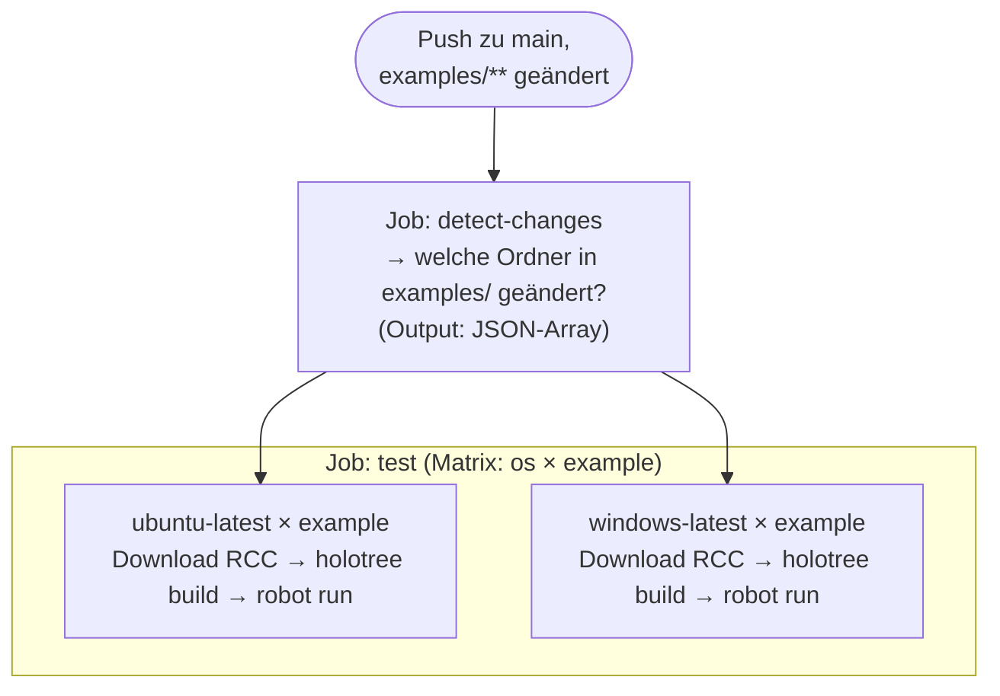

# CI, Branches & Automatisierung

## GitHub Actions CI

### Workflow: `test-examples.yml`

2-stufiges Design:



- **`fail-fast: false`**: Ein fehlgeschlagenes Beispiel bricht nicht den Rest ab
- **`workflow_dispatch`**: Manueller Trigger; `example`-Input für gezielten Test eines Beispiels
- **RCC in CI**: Wird per `curl` von GitHub Releases heruntergeladen — kein committed Binary nötig

### Lokale CI-Tests mit `act`

[`act`](https://github.com/nektos/act) simuliert GitHub Actions lokal in Docker.

```bash
# Installation (macOS)
brew install act
```

Eine `.actrc` im Repo-Root setzt das Docker-Image vor — kein manuelles Flag nötig:

```
-P ubuntu-latest=catthehacker/ubuntu:act-22.04
```

Danach:

```bash
# Alle geänderten Suites testen (simuliert push)
act push -j test

# Nur eine Suite (workflow_dispatch)
act workflow_dispatch -j test --input suite=examples/cryptolibrary
act workflow_dispatch -j test --input suite=templates/cryptolibrary

# Nur den detect-changes Job
act push -j detect-changes
```

### Workflow: `release-please.yml`

Auf jedem Merge in `main` prüft Release Please, ob Conventional-Commit-Messages
einen Release rechtfertigen (`feat:`, `fix:`, etc.). Falls ja, öffnet es automatisch
einen Release-PR mit Changelog. Nach dem Merge wird ein GitHub Release erzeugt.

Basic:

- `build` Commits that affect build-related components such as build tools, dependencies, project version, ...
- `chore` Commits that represent tasks like initial commit, modifying `.gitignore`, ...
- `docs` Commits that exclusively affect documentation
- `feat` Commits that add, adjust or remove a feature to/of/from the API or UI
- `fix` Commits that fix an API or UI bug of a preceded `feat` commit
- `test` Commits that add missing tests or correct existing ones
- `ops` Commits that affect operational aspects like infrastructure (IaC), deployment scripts, CI/CD pipelines, backups, monitoring, or recovery procedures, ...

Advanced:

- `refactor` Commits that rewrite or restructure code without altering API or UI behavior
- `perf` Commits are special type of `refactor` commits that specifically improve performance
- `style` Commits that address code style (e.g., white-space, formatting, missing semi-colons) and do not affect application behavior

---

## Branch-Strategie für ältere Versionen

`main` enthält immer die **aktuellste** Dependency-Kombination.

Für ältere Kombinationen (z. B. RF 6 + Browser 19.1) gibt es `compat/**`-Branches:

```bash
git checkout -b compat/rf6-browser191
# Versionen in generate-all.sh anpassen → RF_VERSION="6.1.1", BROWSER_VERSION="19.1.x"
task generate
git commit -m "chore: set versions for RF6/Browser191 compat branch"
git push origin compat/rf6-browser191
```

Der CI-Workflow läuft automatisch auch auf `compat/**`-Branches (`branches: ["main", "compat/**"]`).

---

## README-Automatisierung und Git Hooks

### `update_suite_table.py` — Automatische Tabellen-Aktualisierung

Das Skript `.github/scripts/update_suite_table.py` aktualisiert die Suite-Tabellen in der
Root-`README.md` automatisch:

- Liest `conda.yaml` jedes `examples/`- und `templates/`-Verzeichnisses für Versionen
- Liest die `Documentation`-Sektion aus der ersten `.robot`-Datei als Beschreibung
- Schreibt zwischen die Marker `<!-- EXAMPLES-TABLE-START/END -->`,
  `<!-- TEMPLATES-TABLE-START/END -->` und `<!-- LABS-TABLE-START/END -->`
- Für `examples/` und `labs/`: 4. Spalte „try out online" mit Link auf `robotmk/example-<name>`

```bash
# Lokal ausführen (setzt pyyaml voraus):
source .venv/bin/activate
python3 .github/scripts/update_suite_table.py .
```

### Workflow: `update-readme.yml`

Wird ausgelöst:
- Nach erfolgreichem CI-Lauf (`workflow_run` auf `Run Suites`)
- Bei Push auf `main` mit Änderungen in `conda.yaml`-Dateien
- Manuell (`workflow_dispatch`)

Committet Änderungen mit `[skip ci]` um Endlosschleifen zu vermeiden.

### Git Hook: `pre-push`

Registriert via `task install-hooks`. Läuft vor jedem `git push`:

1. `task generate` ausführen
2. Prüfen ob nicht-committete Änderungen entstanden sind
3. Falls ja: Push abbrechen und Änderungen anzeigen

```bash
task install-hooks   # Einmalig nach dem Klonen
```

Der Hook liegt in `.githooks/pre-push` und wird über
`git config core.hooksPath .githooks` aktiviert.
