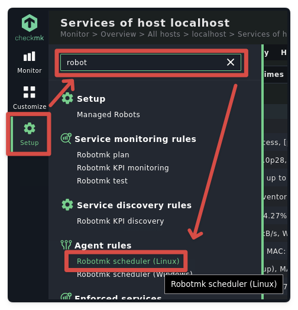
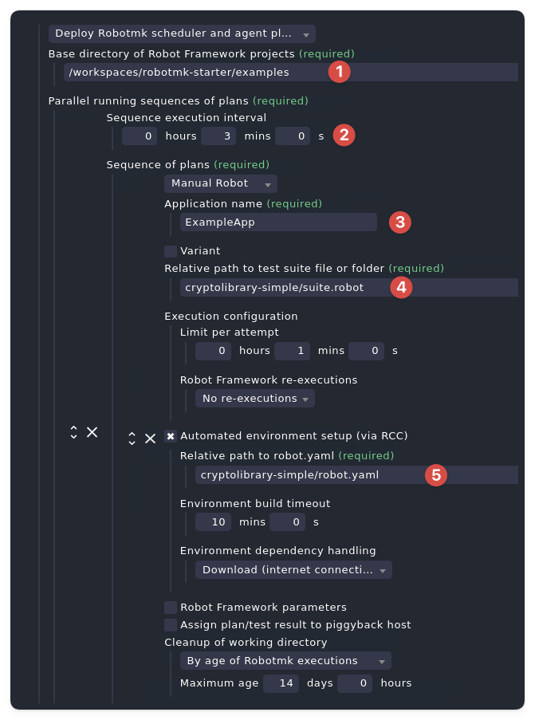
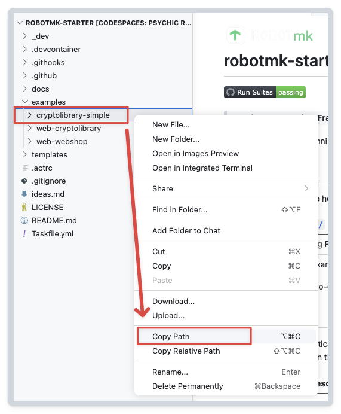
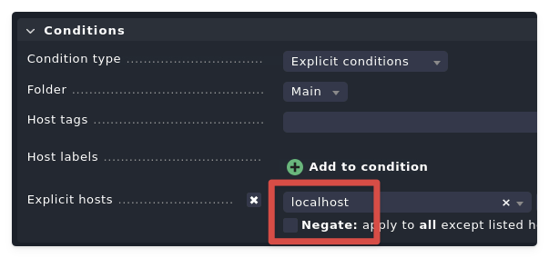
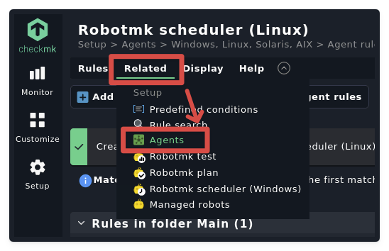
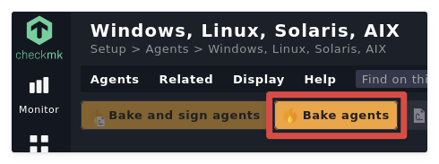
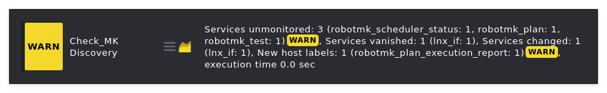
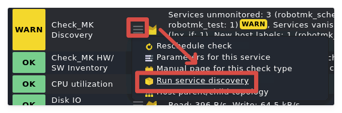
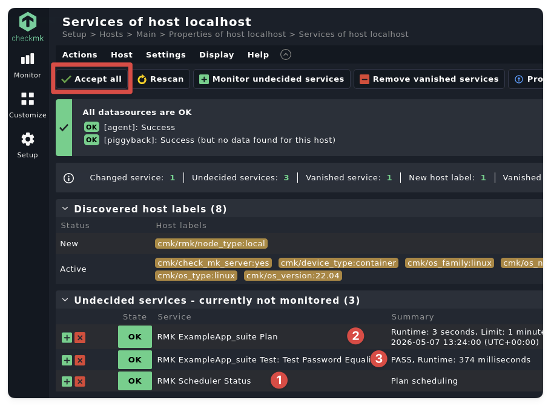

# Using Robotmk in Codespace

[< back to README](../README.md)


## Step 1: Start Codespace

Click the "*Open in GitHub Codespaces*" badge below:


[](https://github.com/codespaces/new?hide_repo_select=true&ref=main&repo=1229554077)


Choose a Checkmk version (2.4 or 2.5) and set the CPUs at least to 4 (to shorten the environment creation time):


Wait for VS Code to open in the Browser and the Codespace to be provisioned (this can take a few minutes, especially on the first run).  
Open the **integrated terminal** to see the provisioning logs.  
Once it's done, you should see a message like this:


## Step 2: Open Checkmk in the Browser

Switch to the "**PORTS**" tab where you can connect to the Checkmk instance by clicking on the published port: 


In the "noVNC" viewer page, click on "*connect*": 


Right-Click on the desktop (yes, this black thing is a desktop) and choose to open "Checkmk". This will open Firefox and navigate to the Checkmk instance running in the container. The default credentials are `cmkadmin` / `cmk`:


Now yyou should see the Checmk Web UI: 


## Step 3: Add the Codespace host as monitoring target in Checkmk

On the left sidebar, click on "*Setup*" → "*Hosts*" → "*Add host*".


Just enter the hostname `localhost` and click "*Save & run service discovery*". 

Checkmk will automatically discover some services on the Codespace host, which you can then activate:


## Step 4: Configure the Robotmk Scheduler

In the *Setup* menu, search for "*Robotmk Scheduler (Linux)*" and add a new rule: 



In the following, the mandatory fields are: 




1. ***Base Directory***: Where the Robot Framework suites (organized in folders) are located. In this case, it's `/workspaces/robotmk-starter/examples/` (the workspace is mounted in the container at the same path).
2. ***Sequence Interval***: You can configure multiple sequences with different intervals. Plans inside a sequence will be executed in the defined order (sequentially).
3. ***Application Name***: The name of the application you are testing. Will be available as a service label in the discovered services. 
4. ***Relative path to test suite***: The relative path to the test suite **suite.robot** within the *Base Directory*.
5. ***robot.yaml***: Similar to the *suite file*, this path is relative to the *Base Directory* and points to the `robot.yaml` file that defines the file the Scheduler uses to create the individual environments. 

**Hint:** For step 1, 4 and 5 it helps to copy the full path to the folder in VS Code: 




Lastly, it isn’t strictly necessary on this instance, but in a production environment you must remember to restrict the rule to only those hosts on which the RobotMK Scheduler is supposed to run the tests:



After that, click on "*Save*".

## Step 5: Bake the Checkmk Agent

The fastest way to get from here to the ***Agent Bakery*** is to click on *Related* → *Agents*:



In the bakery, the orange button *Bake agents* creates the agent package for the specific host(s). 



## Step 6: Install the Checkmk Agent

```bash
> bash /workspaces/robotmk-starter/.devcontainer/cmk-cloud-24-latest/install_cmk_agent.sh
```

This installs the agent for the host **localhost** and starts the scheduler.  
(Note: systemd is missing on the docker container, the way the scheduler is started is a bit hacky, but it works for demo purposes. In production, the scheduler gets started automatically.)

Wait some minutes so that the scheduler can create the runtime environment and execute the test suite for the first time.

## Step 7: Discover the Robotmk Service in Checkmk

The service "*Check_MK Discovery*" will change its state to **WARN** as soon as Checkmk has received the first test result from the Robotmk Scheduler:  



From the hamburger menu of the service, click on "*Run service discovery*"



Checkmk should discover now **3 more services**: 

1. **RMK Scheduler Status**: Shows the status of the scheduler
2. **RMK Plan**: The overall statius of the plan (=whether Robotmk was able to run the suite at all - regardless of th results of the test cases
3. **RMK Test Case**: One service per test case, showing the result of the test case (OK/WARN/CRIT)

Click on *Accept All* and save the configuration:




Finally, you will see the three services with an UNKNOWN state in the list of services.  
Trigger a new execution of the agent which returns the test results to Checkmk:

Voila, you have successfully run your first Robot Framework suite with Robotmk in Checkmk, all within a GitHub Codespace!

---

## Closing Notes

Also try the other RF suites in the `/examples` folder, they all work in the Codespace environment.  
This is only the beginning of the journey, there is a lot more to explore in the world of Robot Framework, Robotmk and Checkmk.  

I have tried my best to make the Codespace environment as close as possible to a real production environment, but of course there are some limitations (e.g. no systemd, limited resources, etc.). In case you have found a bug or have suggestions for improvements, please feel free to open an issue or even better, a pull request.

If you want to learn more, there are several ways of how we can support you:

- [Synthetic Monitoring Trainings](https://lp.robotmk.org/robotmk-masterclass-4d-en)
- Implementing a **Robotmk POC** in your company
- Know How Transfer
- Code Review of existing Tests & Coaching Sessions
- "Extended Workbench" - We work together on your test automation projects for a defined period of time

Reach out to us via mail at robotmk.org or book a free [clarification call](https://meet.brevo.com/simon-meggle).


**Simon Meggle**  
*CEO Elabit GmbH*  
*Founder of Robotmk*  
*Product Manager of Synthetic Monitoring at Checkmk*
