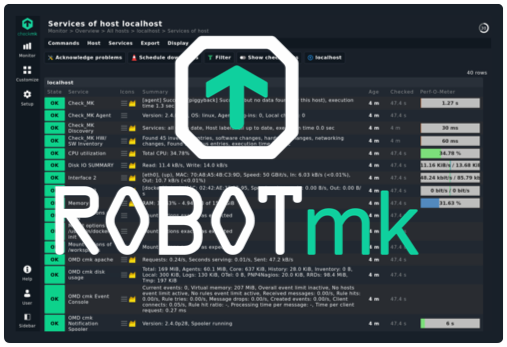
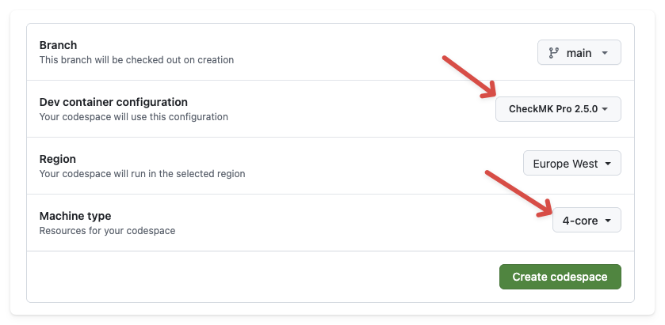
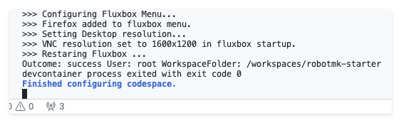
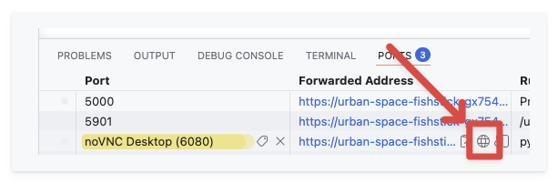
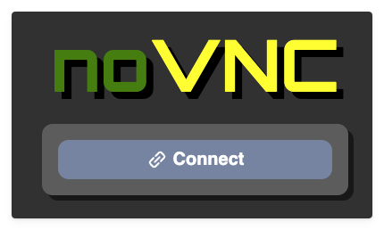
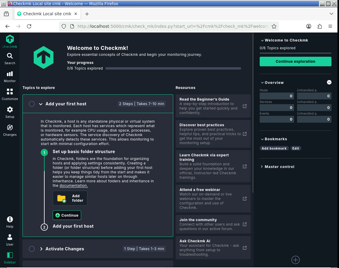
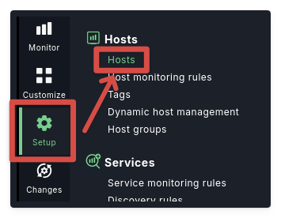
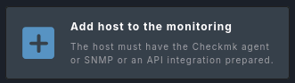
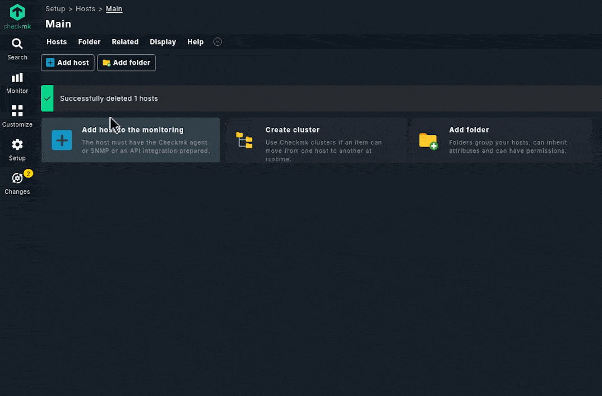

# Using Checkmk in Codespace

[< back to README](../README.md)

## Step 1: Start Codespace

Click the "*Open in GitHub Codespaces*" badge below:

Choose a Checkmk version (2.4 or 2.5) and set the CPUs at least to 4 (to shorten the environment creation time):

Wait for VS Code to open in the Browser and the Codespace to be provisioned (this can take a few minutes, especially on the first run).  
Open the **integrated terminal** to see the provisioning logs.  
Once it's done, you should see a message like this:

## Step 2: Open Checkmk in the Browser

Switch to the "**PORTS**" tab where you can connect to the Checkmk instance by clicking on the published port: 

In the "noVNC" viewer page, click on "*connect*": 

Right-Click on the desktop (yes, this black thing is a desktop) and choose to open "Checkmk". This will open Firefox and navigate to the Checkmk instance running in the container. The default credentials are `cmkadmin` / `cmk`:

Now yyou should see the Checmk Web UI: 

## Step 3: Add the Codespace host as monitoring target in Checkmk

On the left sidebar, click on "*Setup*" → "*Hosts*" → "*Add host*".

Just enter the hostname `localhost` and click "*Save & run service discovery*". 

Checkmk will automatically discover some services on the Codespace host, which you can then activate:

