# Starting Robot Framework Suites in a Github Codespace

[< back to README](../README.md)

> **What is a GitHub Codespace?**  
> A Codespace is a browser-based development environment (VS Code) hosted by GitHub — no local installation needed. You can run codespace environment up to 60 hours for free per month. It’s a great way to quickly test and play around with Code without the need to set up a local environment.

## Step 1: Start Codespace

In the README file of the example repository, click the "*Open in GitHub Codespaces*" badge:

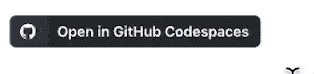

Set the CPUs at least to 4 (to shorten the environment creation time):

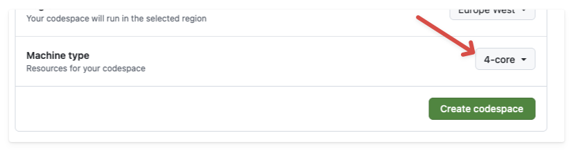

### Startup Checklist

**Don't proceed to the next section until the environment is fully built.** Have an eye on the following things:

Wait for the web version of VS Code to open. 

Click on "*Building Codespace*" to see the build log in the integrated terminal:

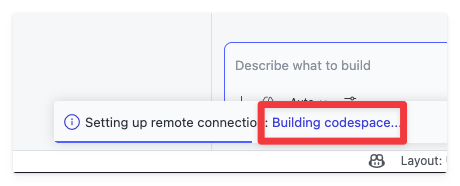

Then the postcommand will be started: 

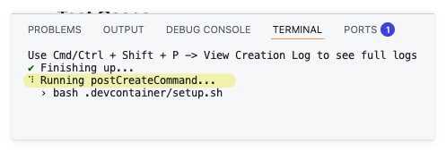

After some time, the README.md file will open automatically. 

Close all messages about open ports like these: 

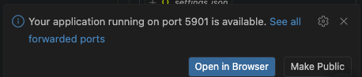

You will soon notice a new folder **.vscode** appearing in the file explorer, which contains the auto-generated configuration for the Codespace environment:   

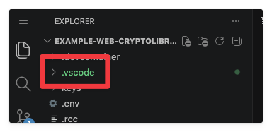

**This is the moment when the environment has been built successfully and VS Code is configured to use it.**  
**Only now you should proceed to the next steps.** 

Now click on the `.robot` file in the file explorer. Opening a Robot Framework file triggers the RobotCode extension to parse the file. 

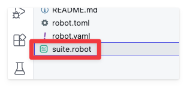

If everything worked fine, you should see that: 

- The RobotCode extension has been activated (check the status bar: curly brackets left of "RobotCode")
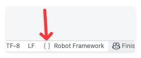
- In the Robot Framework file, there are green "play" icons next to the test cases, which means that the RobotCode extension is ready to run the tests.
- 
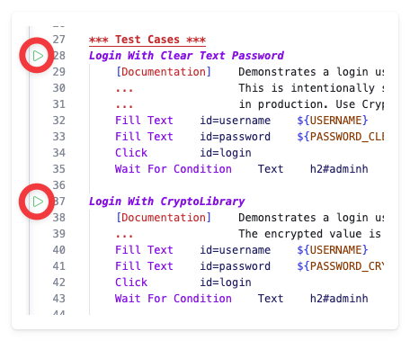

## Step 2: Open the VNC Desktop

*(**Note:** A desktop is only started for web based tests)*

Switch to the "**PORTS**" tab where you can connect via VNC to the container's desktop by clicking on the published port: 

In the "noVNC" viewer page, click on "*connect*": 

You should see a white canvas (yes, this *is* a desktop). This is where you will see the browser opening when you run the web-based Robot Framework tests in the next steps

## Step 3: Run the Robot Framework tests

Now click on one of the "play" icons next to the test cases in the Robot Framework file.  
If the test is web based, switch now to the other tab with the noVNC desktop to see the browser opening and the test running.

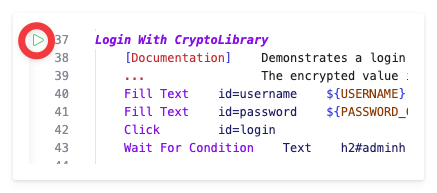

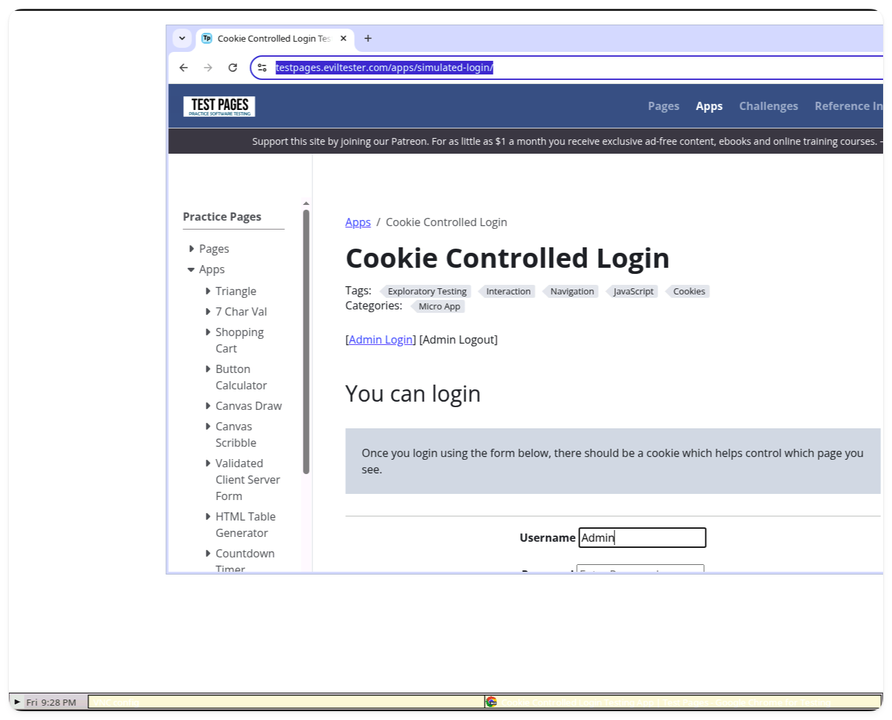

Voila, you have successfully run your first Robot Framework test inside a GitHub Codespace container!

Now you can play around with the test, alter the test steps, add new ones, and see the changes live in the Codespace environment.

---
## About

Found a bug or have a suggestion?  
→ [Open an issue](https://github.com/robotmk/robotmk-starter/issues) or submit a [pull request](https://github.com/robotmk/robotmk-starter/pulls) — contributions are welcome.

Want to go deeper? Want ot get a certified professional?  
→ I offer [Synthetic Monitoring Trainings](https://lp.robotmk.org/robotmk-masterclass-4d-en) or book a free [call](https://meet.brevo.com/simon-meggle).

**Simon Meggle** — Founder of Robotmk, Product Manager Synthetic Monitoring at Checkmk
